yuu-eguci
===

- 🇯🇵 駆け出しパイソニスタ
- 🇬🇧 Amateur Hobby Pythonista
- 🇷🇴 Pythonista Amator de Hobby

## Portfolio web site

[https://portfolio.hitoren.net/](https://portfolio.hitoren.net/)

## My recent projects

### 🌻 flower-stuff

- [https://github.com/yuu-eguci/flower-stuff-lab](https://github.com/yuu-eguci/flower-stuff-lab)
- `python3` `machine-learning` `keras` `image-recognition` `deep-learning` `joint-development`
- with [@ayano1212](https://github.com/ayano1212) and [@goodluckpenpen](https://github.com/goodluckpenpen)

[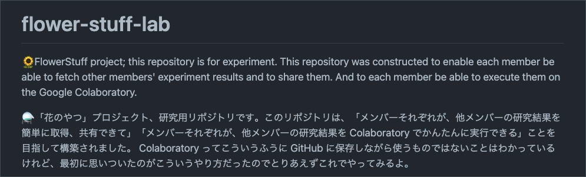](https://github.com/yuu-eguci/flower-stuff-lab)

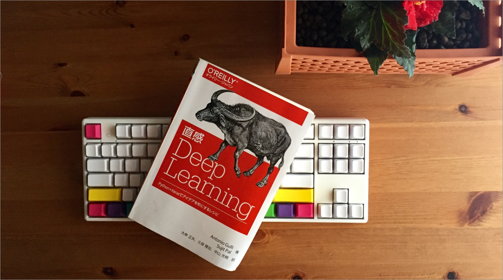

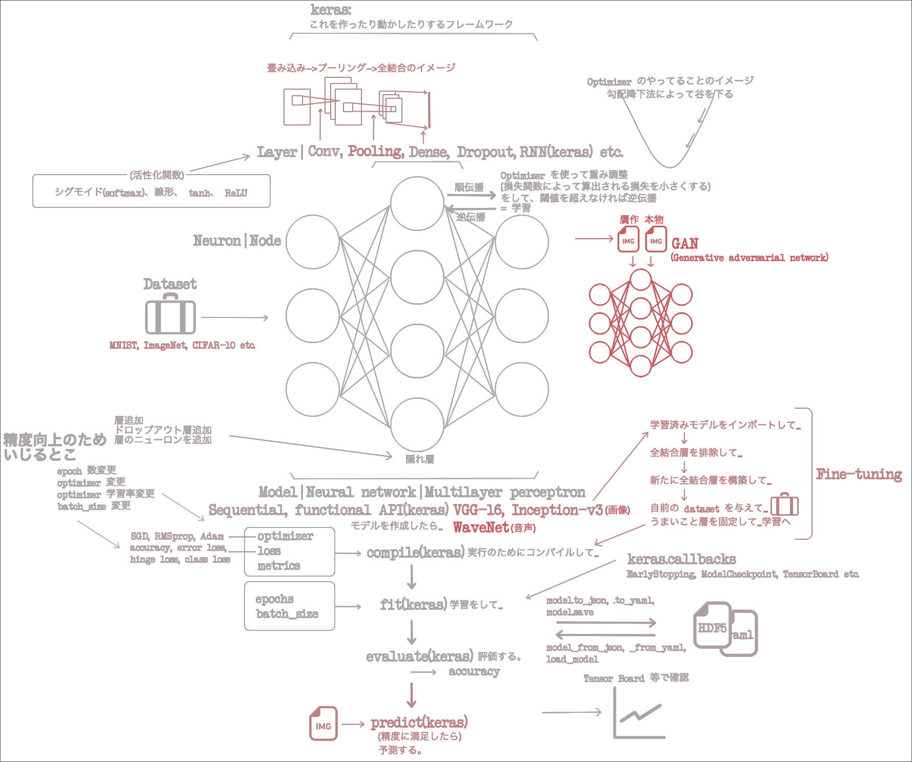

### 🏇 G1-point

- [https://github.com/python-mate/G1-point](https://github.com/python-mate/G1-point)
- `python3` `web-scraping` `line-bot` `ci-cd` `spread-sheet`
- with [@REDpapa](https://github.com/REDpapa)

[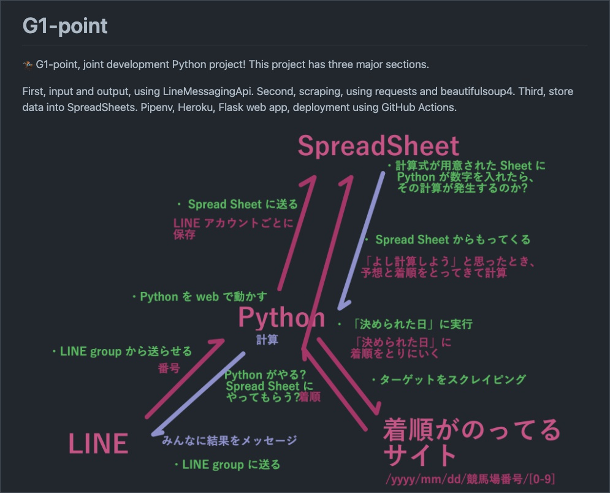](https://github.com/python-mate/G1-point)

### 📈 Shuumulator project

- [https://github.com/yuu-eguci/Shuumulator](https://github.com/yuu-eguci/Shuumulator)
- `python3` `web-scraping` `vue.js` `ci-cd` `stock-simulator` `django`

[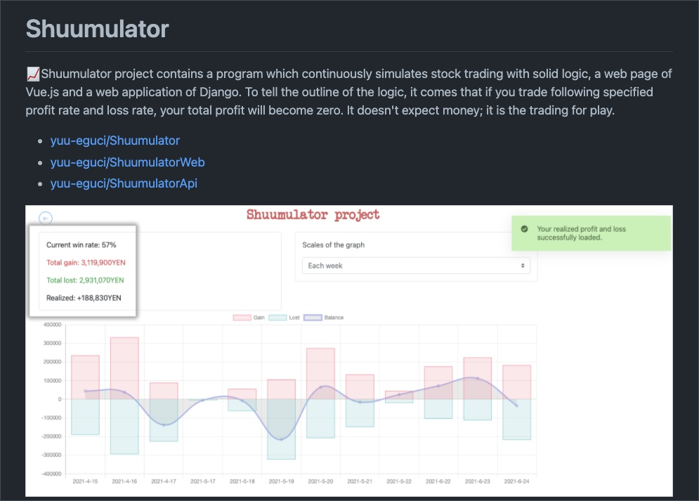](https://github.com/yuu-eguci/Shuumulator)

## My recent reading

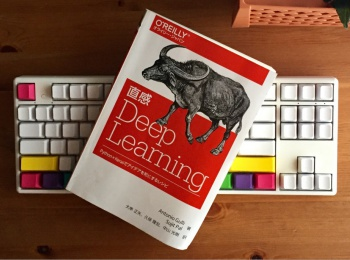 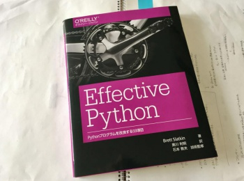 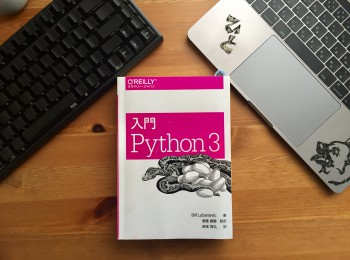

## My artworks

Other works are in [my website](https://portfolio.hitoren.net/); "artwork" content!

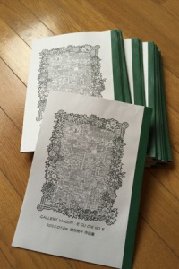  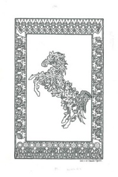 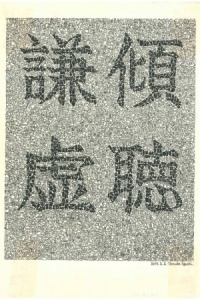 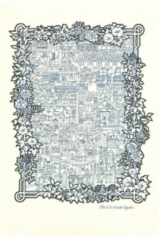

---

_This readme template is licensed under [WTFPL](http://www.wtfpl.net/)._
