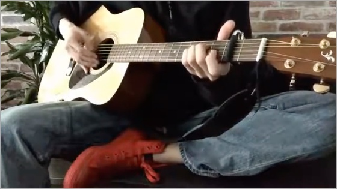

yuu-eguci
===

- 🇯🇵 趣味パイソニスタ
- 🇬🇧 Hobby Pythonista
- 🇷🇴 Pythonista de Hobby

   
  

## Portfolio web site

[https://portfolio.hitoren.net/](https://portfolio.hitoren.net/)

## Recent projects

### 📷 flower-stuff-easy-web

- [https://github.com/yuu-eguci/flower-stuff-easy-web-docker](https://github.com/yuu-eguci/flower-stuff-easy-web-docker)
- `python3` `django` `vuejs` `docker` `github-actions` `github-pages` `azure-app-service` `ci-cd` `linux`

### 🌻 flower-stuff

- [https://github.com/python-mate/flower-stuff-lab](https://github.com/python-mate/flower-stuff-lab)
- `python3` `machine-learning` `keras` `image-recognition` `deep-learning` `joint-development`
- with [@ayano1212](https://github.com/ayano1212) and [@SakamotoYuuhi](https://github.com/SakamotoYuuhi)

### 🏇 G1-point

- [https://github.com/python-mate/G1-point](https://github.com/python-mate/G1-point)
- `python3` `web-scraping` `line-bot` `ci-cd` `spread-sheet`
- with [@REDpapa](https://github.com/REDpapa)

### 📈 Shuumulator project

- [https://github.com/yuu-eguci/Shuumulator](https://github.com/yuu-eguci/Shuumulator)
- `python3` `web-scraping` `vue.js` `ci-cd` `stock-simulator` `django`

## Recent reading

  

## Artworks

Other works are in [my website](https://portfolio.hitoren.net/); "artwork" content!

    

## Guitar play

[https://www.youtube.com/watch?v=k1PTT-dIQUc](https://www.youtube.com/watch?v=k1PTT-dIQUc)

---

_This readme template is licensed under [WTFPL](http://www.wtfpl.net/)._
